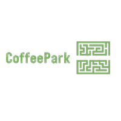
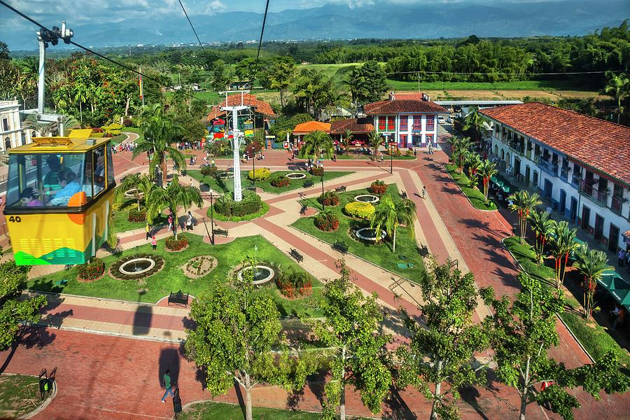

<!-- PROJECT LOGO -->
 

  

  <h3 align="center">Coffee Park Maze Runner</h3>

  

    Do you like online games? Do you like mazes? Then don't miss Maze Runner, the new online game made in Java!
     
  
  

<!-- ABOUT THE PROJECT -->
## About The Project

  </a>

Coffee Park is an exciting and challenging maze runner game inspired by the rich and vibrant Coffee Park of Colombia. Developed by two passionate Colombian students, this immersive game will take you on an unforgettable adventure through the maze, where you will face a variety of obstacles, puzzles, and enemies while trying to find your way out. Use your wit, problem-solving skills, and strategic thinking to overcome these challenges and escape the maze victorious.

Hint: You need the Key to be able to open the exit door. Don't forget to collect it 

(<a href="#readme-top">back to top</a>)

### Built With

* 
  </a>

Open-source Java framework for developing 2D desktop, web, and mobile games.
It is designed to be lightweight and portable, it is also highly customizable and allows developers to create games with a wide variety of graphics and gameplay styles.

(<a href="#readme-top">back to top</a>)

<!-- CONTACT -->
## Contact

* Valentina Velasquez - [@valentinavconde](https://github.com/valentinavconde)
* Lina Quinones  - [@linajuliethq](https://github.com/linajuliethq)

Project Link: xxxx

